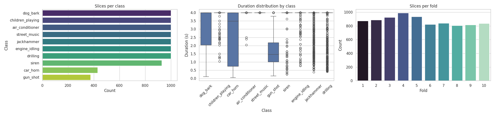
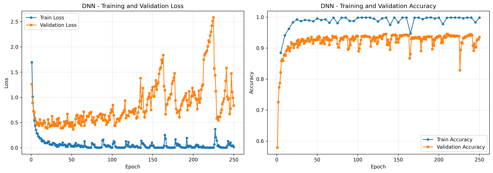
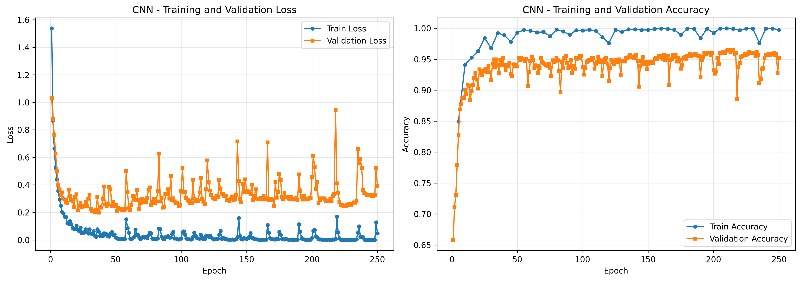
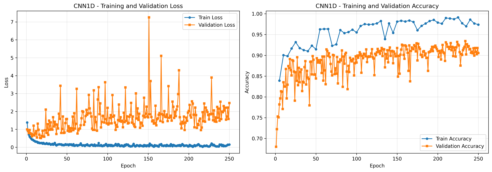
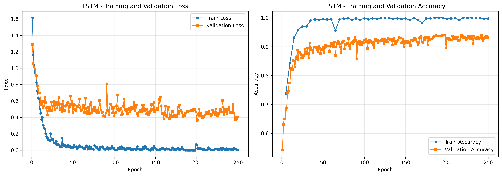

# UrbanSound8K Sound Classifier

End-to-end PyTorch pipeline for UrbanSound8K. Audio slices from `archive/` are converted into 128-d MFCC statistics (for dense models) plus full MFCC sequences (for CNN/LSTM). A unified training entry point reproduces the experimentation flow from `debug.ipynb`, including random 80/20 splits, reporting, and artifact exports.

## Dataset Overview



- **Slices per class**: Dataset is moderately imbalanced (e.g., `children_playing` and `street_music` dominate while `gun_shot` is scarce).  
- **Durations**: Most samples span 3–4 seconds with notable class-dependent spread.  
- **Folds**: Original CSV provides 10 folds of roughly equal size; we now draw random splits across all folds for neural training while folds remain available for baselines.

## Models

| Model | Input | Highlights |
|-------|-------|------------|
| `dnn` | 128-d MFCC mean vector | Mirrors ANN architecture from `debug.ipynb` (Linear/ReLU stack). |
| `cnn` | (1 × 128 × T) MFCC map | 2D CNN with two Conv/Pool stages and dense head. |
| `cnn1d` | Flattened MFCC sequence (128 channels) | Keras-inspired Conv1D tower with adaptive pooling. |
| `lstm` | (T × 128) sequence | Single-layer LSTM plus linear classifier. |

All neural models share the same extractor (`src/features/extractor.py`) and are trained via `src/training/train_nn.py`.

## Results & Artifacts

Training automatically writes to `artifacts/results/`:

- `*_history.json` – per-epoch metrics.  
- `*_training_history.png` – loss & accuracy curves (e.g., `dnn_random_rs42_training_history.png`).  
- `*_cm.png` – confusion matrices.  
- `*_report.txt` – precision/recall/F1 tables.

### Classification Summary (fill in with latest runs)

| Model | Accuracy | Macro F1 | Notes |
|-------|----------|----------|-------|
| DNN (random_rs42) | 0.95 | 0.94 | Strong baseline mirroring notebook ANN. |
| CNN (random_rs42) | 0.96 | 0.97 | Best overall F1; excels on rare `gun_shot`. |
| CNN1D (random_rs42) | 0.93 | 0.94 | Lighter 1D stack; slightly weaker on `children_playing`. |
| LSTM (random_rs42) | 0.94 | 0.94 | Sequence-aware; competitive accuracy. |

Artifact filenames follow `{model}_random_rs{seed}_*`, reflecting the stratified 80/20 split controlled by `--random-state`.

### Training History Snapshots

Each run stores its own loss/accuracy curves. Use them to spot overfitting and tune schedules:

- **DNN**  
  
- **CNN**  
  
- **CNN1D**  
  
- **LSTM**  
  

## Setup

```bash
python -m venv .venv
source .venv/bin/activate
pip install -r requirements.txt
```

## Training Neural Models

Run training directly from the project root:

```bash
python -m src.training.train_nn \
  --model dnn \
  --epochs 250 \
  --batch-size 32 \
  --lr 1e-3 \
  --test-size 0.2 \
  --random-state 42
```

Key arguments:

- `--model`: `dnn`, `cnn`, `cnn1d`, `lstm`.  
- `--test-size`: validation ratio (default `0.2`).  
- `--random-state`: seed for stratified `train_test_split`.  
- `--epochs`, `--batch-size`, `--lr`, `--device` as usual.  
- `--clear-cache`: drop cached features under `artifacts/cache/` if extractor settings change.

Model metadata (architecture, parameter counts, device info) prints before training begins. Checkpoints plus plots/reports land under `artifacts/results/`.

## Project Structure

- `src/config.py` – global constants (sample rate, MFCC size, class names).  
- `src/features/extractor.py` – waveform loading + MFCC mean/sequence extraction with caching.  
- `src/data/urban_sound.py` – dataset objects, random train/test split, padded collate fn.  
- `src/models/` – DNN, CNN, CNN1D, LSTM definitions.  
- `src/training/` – neural training entry point (`train_nn`).  
- `src/utils/metrics.py` – metric calculation and visualization helpers.  
- `artifacts/` – cache, checkpoints, and results.

## TODO / Next Steps

- [ ] Add automated audio augmentation (time stretch, pitch shift).  
- [ ] Support mixed-precision & gradient accumulation for larger CNNs.  
- [ ] Provide CLI for single-file inference aligned with notebook tester.  
- [ ] Experiment with SpecAugment and attention-based architectures.
